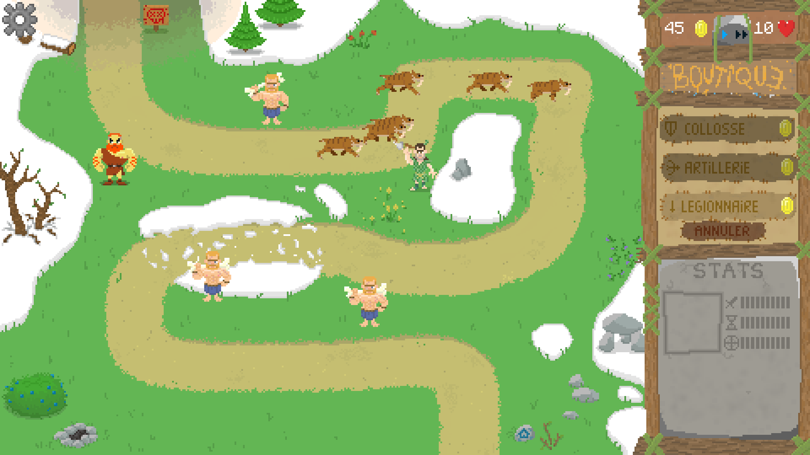

# 🏰 Bastion des Âges

**Un jeu Tower Defense en Python avec Pygame**  
Développé par Téis, Ewenn et Simon

---

## 🎮 Présentation du jeu

Bastion des Âges est un jeu de type *Tower Defense* où le joueur doit défendre sa base contre des vagues d'ennemis.  
Placez stratégiquement différentes tourelles (classique, artillerie, etc.) pour repousser les attaques ennemies.

---

## ⚙️ Fonctionnalités principales

- 🌊 Système de vagues d'ennemis
- 🧱 Plusieurs types de tourelles
- 💸 Système d'argent et d'amélioration
- 🗺️ Carte avec emplacements définis pour poser les tourelles

---

## 🎨 Thème du jeu et graphisme

*Bastion des Âges* plonge le joueur dans un univers préhistorique où il doit affronter plusieurs grands prédateurs de son temps. L’esthétique visuelle se rapproche d’un style pixel art sombre, évoquant des jeux classiques tout en intégrant des éléments modernes de lumière et d’ambiance.

---

### Extrait visuel




## 🕹️ Comment jouer

1. Lancez le jeu avec Python :
   ```bash
   python main.py
2. Cliquer sur les emplacements pour poser des tourelles
3. Gérer votre argent pour améliorer votre défense
4. Tenter de survivre le plus longtemps possible !

---

## 🖥️ Pré-requis

- Python 3.10 ou plus 
- Installer la bibliothèque Pygame :

   ```bash
   pip install pygame
---

## 📦 Télécharger le jeu

➡️ [Clique ici pour télécharger Bastion des Âges (.zip)](https://drive.google.com/uc?export=download&id=14SqKLZbqZ-m1JzSvuDlD2_KYZMtCguRu)

Dézippez le dossier, ouvrez un terminal dans le dossier, puis lancez main.py pour jouer.

---

## 🎥 Vidéo de démonstration

Une courte vidéo explicative sera ajoutée prochainement pour montrer comment lancer le jeu et comment y jouer.

---

## 👨‍💻 Crédits

Ce projet a été réalisé dans le cadre du cours de NSI en terminale.
Merci à notre professeur pour son accompagnement tout au long du projet.

---
